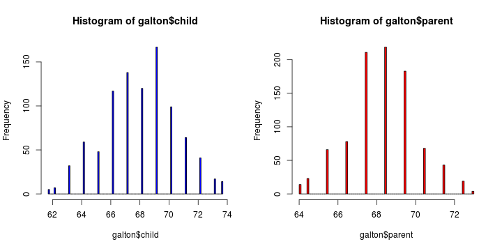

Regression Models
=================

## Introduction

Questions concerning *regression models*:
  * To use the parents' heights to predict children' heights.
  * To try to find a parsimonious, easily described mean relationship between parent and children's heights.
  * To investigate the variation in childrens' heights that appears 
  unrelated to parents' heights (residual variation).
  * To quantify what impact genotype information has beyond parental height in explaining child height.
  * To figure out how/whether and what assumptions are needed to generalize findings beyond the data in question.  
  * Why do children of very tall parents tend to be tall, but a little shorter than their parents and why children of very short parents tend to be short, but a little taller than their parents? (This is a famous question called *Regression to the mean*.)
  
---
## Galton's Data

  * Galton's Data was used by Francis Galton in 1885. 
  * Galton was a statistician who invented the term and concepts of regression and correlation, founded the journal Biometrika, and was the cousin of Charles Darwin.
  * Let's look at the marginal (parents disregarding children and children disregarding parents) distributions first. 
  * Parent distribution is all heterosexual couples.
  * Correction for gender via multiplying female heights by 1.08.
  * Overplotting is an issue from discretization.
  

```r
require(MASS)
```

```
## Loading required package: MASS
```

```r
library(UsingR)
str(galton)
```

```
## 'data.frame':	928 obs. of  2 variables:
##  $ child : num  61.7 61.7 61.7 61.7 61.7 62.2 62.2 62.2 62.2 62.2 ...
##  $ parent: num  70.5 68.5 65.5 64.5 64 67.5 67.5 67.5 66.5 66.5 ...
```

```r
par(mfrow = c(1, 2))
hist(galton$child, col = "blue", breaks = 100)
hist(galton$parent, col = "red", breaks = 100)
```

 


---
### Finding the *middle* via least squares

Consider only the children's heights. 
  * How could one describe the "middle"?
  * One definition, let $Y_i$ be the height of child $i$ for $i = 1, \ldots, n = 928$, then define the middle as the value of $\mu$ that minimizes $$\sum_{i=1}^n (Y_i - \mu)^2$$
  * This is physical center of mass of the histrogram.
  * We can prove that $\mu = \bar Y$.

**Proof.**

$$ 
\begin{align} 
\sum_{i=1}^n (Y_i - \mu)^2 & = \
\sum_{i=1}^n (Y_i - \bar Y + \bar Y - \mu)^2 \\ 
& = \sum_{i=1}^n (Y_i - \bar Y)^2 + \
2 \sum_{i=1}^n (Y_i - \bar Y)  (\bar Y - \mu) +\
\sum_{i=1}^n (\bar Y - \mu)^2 \\
& = \sum_{i=1}^n (Y_i - \bar Y)^2 + \
2 (\bar Y - \mu) \sum_{i=1}^n (Y_i - \bar Y)  +\
\sum_{i=1}^n (\bar Y - \mu)^2 \\
& = \sum_{i=1}^n (Y_i - \bar Y)^2 + \
2 (\bar Y - \mu)  (\sum_{i=1}^n Y_i - n \bar Y) +\
\sum_{i=1}^n (\bar Y - \mu)^2 \\
& = \sum_{i=1}^n (Y_i - \bar Y)^2 + \sum_{i=1}^n (\bar Y - \mu)^2\\ 
& \geq \sum_{i=1}^n (Y_i - \bar Y)^2 \
\end{align} 
$$

So that $\sum_{i=1}^n (Y_i - \mu)^2$ gets the minimum iff $\mu = \bar Y$.

---
### Comparing children's heights and their parents' heights
On the right figure, the size of point represents number of points at that (X, Y) combination.

```r
par(mfrow = c(1, 2))
plot(x = galton$parent, y = galton$child, pch = 19, col = "blue", xlab = "parent", 
    ylab = "child")

freqData <- as.data.frame(table(galton$child, galton$parent))
names(freqData) <- c("child", "parent", "freq")
plot(as.numeric(as.vector(freqData$parent)), as.numeric(as.vector(freqData$child)), 
    pch = 21, col = "black", bg = "lightblue", cex = 0.15 * freqData$freq, xlab = "parent", 
    ylab = "child")
```

 


