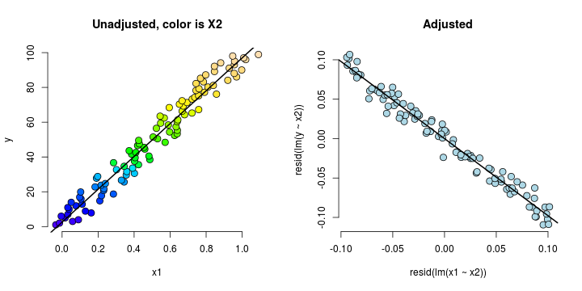
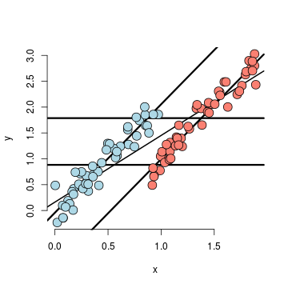
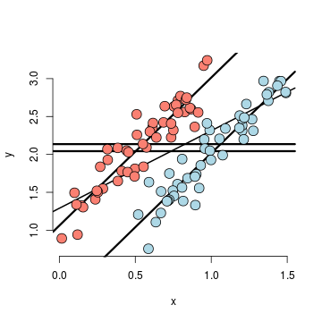
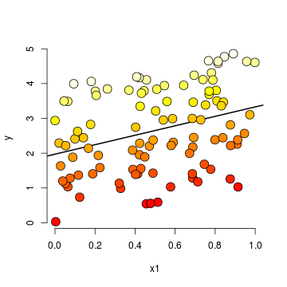
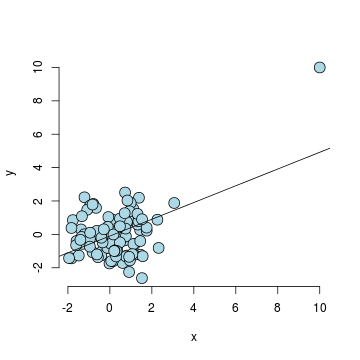

Regression Models
=================
*This note is a reorganization of Dr. Brian Caffo's lecture notes for the Coursera course [Regression Models](https://class.coursera.org/regmods-002).*

# Module I : Least Squares and Linear Regression

## Introduction

Questions concerning *regression models*:
  * To use the parents' heights to predict children' heights.
  * To try to find a parsimonious, easily described mean relationship between parent and children's heights.
  * To investigate the variation in childrens' heights that appears 
  unrelated to parents' heights (residual variation).
  * To quantify what impact genotype information has beyond parental height in explaining child height.
  * To figure out how/whether and what assumptions are needed to generalize findings beyond the data in question.  
  * Why do children of very tall parents tend to be tall, but a little shorter than their parents and why children of very short parents tend to be short, but a little taller than their parents? (This is a famous question called *Regression to the mean*.)
  
### Galton's Data

  * Galton's Data was used by Francis Galton in 1885. 
  * Galton was a statistician who invented the term and concepts of regression and correlation, founded the journal Biometrika, and was the cousin of Charles Darwin.
  * Let's look at the marginal (parents disregarding children and children disregarding parents) distributions first. 
  * Parent distribution is all heterosexual couples.
  * Correction for gender via multiplying female heights by 1.08.
  * Overplotting is an issue from discretization.
  

```r
require(MASS)
```

```
## Loading required package: MASS
```

```r
library(UsingR)
str(galton)
```

```
## 'data.frame':	928 obs. of  2 variables:
##  $ child : num  61.7 61.7 61.7 61.7 61.7 62.2 62.2 62.2 62.2 62.2 ...
##  $ parent: num  70.5 68.5 65.5 64.5 64 67.5 67.5 67.5 66.5 66.5 ...
```

```r
par(mfrow = c(1, 2))
hist(galton$child, col = "blue", breaks = 100, xlab = "Child", ylab = "Count")
hist(galton$parent, col = "red", breaks = 100, xlab = "Parent", ylab = "Count")
```

 


### Finding the *middle* via least squares

Consider only the children's heights. 
  * How could one describe the "middle"?
  * One definition, let $Y_i$ be the height of child $i$ for $i = 1, \ldots, n = 928$, then define the middle as the value of $\mu$ that minimizes $$\sum_{i=1}^n (Y_i - \mu)^2$$
  * This is physical center of mass of the histrogram.
  * We can prove that $\mu = \bar Y$.

**Proof.**

$$ 
\begin{align} 
\sum_{i=1}^n (Y_i - \mu)^2 & = \
\sum_{i=1}^n (Y_i - \bar Y + \bar Y - \mu)^2 \\ 
& = \sum_{i=1}^n (Y_i - \bar Y)^2 + \
2 \sum_{i=1}^n (Y_i - \bar Y)  (\bar Y - \mu) +\
\sum_{i=1}^n (\bar Y - \mu)^2 \\
& = \sum_{i=1}^n (Y_i - \bar Y)^2 + \
2 (\bar Y - \mu) \sum_{i=1}^n (Y_i - \bar Y)  +\
\sum_{i=1}^n (\bar Y - \mu)^2 \\
& = \sum_{i=1}^n (Y_i - \bar Y)^2 + \
2 (\bar Y - \mu)  (\sum_{i=1}^n Y_i - n \bar Y) +\
\sum_{i=1}^n (\bar Y - \mu)^2 \\
& = \sum_{i=1}^n (Y_i - \bar Y)^2 + \sum_{i=1}^n (\bar Y - \mu)^2\\ 
& \geq \sum_{i=1}^n (Y_i - \bar Y)^2 \
\end{align} 
$$

So that $\sum_{i=1}^n (Y_i - \mu)^2$ gets the minimum iff $\mu = \bar Y$.

### Regression through the origin
First, let's compare the children's heights and their parents' heights.

On the right figure, the size of point represents number of points at that (X, Y) combination.

```r
par(mfrow = c(1, 2))
plot(x = galton$parent, y = galton$child, pch = 19, col = "blue", xlab = "Parent", 
    ylab = "Child")

freqData <- as.data.frame(table(galton$child, galton$parent))
names(freqData) <- c("child", "parent", "freq")
plot(as.numeric(as.vector(freqData$parent)), as.numeric(as.vector(freqData$child)), 
    pch = 21, col = "black", bg = "lightblue", cex = 0.15 * freqData$freq, xlab = "Parent", 
    ylab = "Child")
```

 


Suppose that $X_i$ are the parents' heights as the **predictor** or explanatory variable and $Y_i$ the response, consider picking the slope $\beta$ that minimizes 
$$\sum_{i=1}^n (Y_i - X_i \beta)^2$$
This is exactly *using the origin as a pivot point* to pick the line that minimizes the sum of the squared vertical distances of the points to the line.

If we subtract the means then the origin is the mean of the parent and children's heights. In such case, the solution is

```r
lm(I(child - mean(child)) ~ I(parent - mean(parent)) - 1, data = galton)
```

```
## 
## Call:
## lm(formula = I(child - mean(child)) ~ I(parent - mean(parent)) - 
##     1, data = galton)
## 
## Coefficients:
## I(parent - mean(parent))  
##                    0.646
```

The best fit line is

```r
freqData <- as.data.frame(table(galton$child, galton$parent))
names(freqData) <- c("child", "parent", "freq")
plot(as.numeric(as.vector(freqData$parent)), as.numeric(as.vector(freqData$child)), 
    pch = 21, col = "black", bg = "lightblue", cex = 0.05 * freqData$freq, xlab = "Parent", 
    ylab = "Child")
lm1 <- lm(galton$child ~ galton$parent)
lines(galton$parent, lm1$fitted, col = "red", lwd = 3)
```

 


---
## Ordinary Least Squares

This time, let's consider finding the best line Child's Height = $\beta_0$ + Parent's Height $\beta_1$ i.e. 
$$Y = \beta_0 + \beta_1 X$$
to minimize the least square residuals
$$
  \dagger := \sum_{i=1}^n [ Y_i - (\beta_0 + \beta_1 X_i)]^2
$$

**Analysis.**

Let $\mu_i := \beta_0 + \beta_1 X_i$ and our estimates be $\hat \mu_i := \hat \beta_0 + \hat \beta_1 X_i$.

Then we want to minimize
$$ \dagger = \sum_{i=1}^n (Y_i - \mu_i)^2 = \sum_{i=1}^n (Y_i - \hat \mu_i) ^ 2 + 2 \sum_{i=1}^n (Y_i - \hat \mu_i) (\hat \mu_i - \mu_i) + \sum_{i=1}^n (\hat \mu_i - \mu_i)^2$$
Suppose that $\sum_{i=1}^n (Y_i - \hat \mu_i) (\hat \mu_i - \mu_i) = 0$ then
$$ \dagger =\sum_{i=1}^n (Y_i - \hat \mu_i) ^ 2  + \sum_{i=1}^n (\hat \mu_i - \mu_i)^2\geq \sum_{i=1}^n (Y_i - \hat \mu_i) ^ 2$$

So that if $\sum_{i=1}^n (Y_i - \hat \mu_i) (\hat \mu_i - \mu_i) = 0$, then the line 
$$Y = \hat \beta_0 + \hat \beta_1 X$$
is the least squares line.

* Now consider forcing $\beta_1 = 0$ and thus $\hat \beta_1=0$ to only consider horizontal lines. Because
$$
\sum_{i=1}^n (Y_i - \hat \mu_i) (\hat \mu_i - \mu_i)  =  \sum_{i=1}^n (Y_i - \hat \beta_0) (\hat \beta_0 - \beta_0)
= (\hat \beta_0 - \beta_0) \sum_{i=1}^n (Y_i   - \hat \beta_0) 
$$
This will equal 0 if $\sum_{i=1}^n (Y_i  - \hat \beta_0) = n\bar Y - n \hat \beta_0=0$. Thus 
$$\hat \beta_0 = \bar Y.$$

* Recall that if we force $\beta_0 = 0$ and thus $\hat \beta_0 = 0$ it is to only consider the regression through the origin. In this case
$$
\sum_{i=1}^n (Y_i - \hat \mu_i) (\hat \mu_i - \mu_i)  =  \sum_{i=1}^n (Y_i - \hat \beta_1 X_i) (\hat \beta_1 - \beta_1)X_i
= (\hat \beta_1 - \beta_1) \sum_{i=1}^n (Y_i X_i   - \hat \beta_1 X_i X_i) 
$$
Thus $$\hat \beta_1 = \frac{\sum_{i=1^n} Y_i X_i}{\sum_{i=1}^n X_i^2}.$$

* In the general case, we will have
$$\begin{align} \
\sum_{i=1}^n (Y_i - \hat \mu_i) (\hat \mu_i - \mu_i) 
= & \sum_{i=1}^n (Y_i - \hat\beta_0 - \hat\beta_1 X_i) (\hat \beta_0 + \hat \beta_1 X_i - \beta_0 - \beta_1 X_i) \\
= & (\hat \beta_0 - \beta_0) \sum_{i=1}^n (Y_i - \hat\beta_0 - \hat \beta_1 X_i) + (\hat \beta_1 - \beta_1)\sum_{i=1}^n (Y_i - \hat\beta_0 - \hat \beta_1 X_i)X_i\\
\end{align} $$
Note that 
$$0=\sum_{i=1}^n (Y_i - \hat\beta_0 - \hat \beta_1 X_i) = n \bar Y - n \hat \beta_0 - n \hat \beta_1 \bar X ~~\mbox{implies that}~~\hat \beta_0 = \bar Y - \hat \beta_1 \bar X $$
Then
$$\sum_{i=1}^n (Y_i  - \hat\beta_0 - \hat \beta_1 X_i) X_i =  \sum_{i=1}^n (Y_i  - \bar Y + \hat \beta_1 \bar X - \hat \beta_1 X_i)X_i = \sum_{i=1}^n [(Y_i  - \bar Y) - \hat \beta_1 (X_i - \bar X)] X_i$$
And thus
$$ \sum_{i=1}^n (Y_i  - \bar Y)X_i - \hat \beta_1 \sum_{i=1}^n
(X_i - \bar X) X_i = 0.$$
So we arrive at
$$
\hat \beta_1 =
\frac{\sum_{i=1}^n (Y_i  - \bar Y)X_i}{\sum_{i=1}^n
(X_i - \bar X) X_i} = 
\frac{\sum_{i=1}^n (Y_i  - \bar Y)(X_i - \bar X)}{\sum_{i=1}^n
(X_i - \bar X) (X_i - \bar X)}
= Cor(Y, X) \frac{Sd(Y)}{Sd(X)}.
$$
And recall
$$
\hat \beta_0 = \bar Y - \hat \beta_1 \bar X.
$$

**Conclusions.**
* The least squares model fit to the line $Y = \beta_0 + \beta_1 X$ through the data pairs $(X_i, Y_i)$ with $Y_i$ as the response obtains the line $Y = \hat \beta_0 + \hat \beta_1 X$ where
  $$\hat \beta_1 = Cor(Y, X) \frac{Sd(Y)}{Sd(X)} ~~~ \hat \beta_0 = \bar Y - \hat \beta_1 \bar X$$
* $\hat \beta_1$ has the units of $Y / X$, $\hat \beta_0$ has the units of $Y$.
* The line passes through the point $(\bar X, \bar Y$)
* The slope of the regression line with $X$ as the response and $Y$ as the predictor is $Cor(Y, X) Sd(X)/ Sd(Y)$. 
* The slope is the same one you would get if you centered the data $(X_i - \bar X, Y_i - \bar Y)$ and did regression through the origin.
* If you normalized the data, $\{ \frac{X_i - \bar X}{Sd(X)}, \frac{Y_i - \bar Y}{Sd(Y)}\}$, the slope is $Cor(Y, X)$.

### Example with Galton's Data

* Double check our calculations using R

```r
y <- galton$child
x <- galton$parent
beta1 <- cor(y, x) * sd(y)/sd(x)
beta0 <- mean(y) - beta1 * mean(x)
rbind(c(beta0, beta1), coef(lm(y ~ x)))
```

```
##      (Intercept)      x
## [1,]       23.94 0.6463
## [2,]       23.94 0.6463
```

* Reversing the response/predictor relationship

```r
beta1 <- cor(y, x) * sd(x)/sd(y)
beta0 <- mean(x) - beta1 * mean(y)
rbind(c(beta0, beta1), coef(lm(x ~ y)))
```

```
##      (Intercept)      y
## [1,]       46.14 0.3256
## [2,]       46.14 0.3256
```

* Regression through the origin yields an equivalent slope if you center the data first

```r
yc <- y - mean(y)
xc <- x - mean(x)
beta1 <- sum(yc * xc)/sum(xc^2)
c(beta1, coef(lm(y ~ x))[2])
```

```
##             x 
## 0.6463 0.6463
```

* Normalizing variables results in the slope being the correlation

```r
yn <- (y - mean(y))/sd(y)
xn <- (x - mean(x))/sd(x)
c(cor(y, x), cor(yn, xn), coef(lm(yn ~ xn))[2])
```

```
##                   xn 
## 0.4588 0.4588 0.4588
```

* Plotting the fit
    * Size of points are frequencies at that X, Y combination.
    * For the red line, the child is response.
    * For the blue, the parent is the response accounting for the fact that the response is plotted on the horizontal axis).
    * Black line is the slope is $Sd(Y)/Sd(X)$, assuming that $Cor(Y, X) = 1$.
    * Big black dot is $(\bar X, \bar Y)$.


```r
freqData <- as.data.frame(table(galton$child, galton$parent))
names(freqData) <- c("child", "parent", "freq")
plot(as.numeric(as.vector(freqData$parent)), as.numeric(as.vector(freqData$child)), 
    pch = 21, col = "black", bg = "lightblue", cex = 0.05 * freqData$freq, xlab = "Parent", 
    ylab = "Child", xlim = c(62, 74), ylim = c(62, 74))
abline(mean(y) - mean(x) * cor(y, x) * sd(y)/sd(x), sd(y)/sd(x) * cor(y, x), 
    lwd = 3, col = "red")
abline(mean(y) - mean(x) * sd(y)/sd(x)/cor(y, x), sd(y)/sd(x)/cor(y, x), lwd = 3, 
    col = "blue")
abline(mean(y) - mean(x) * sd(y)/sd(x), sd(y)/sd(x), lwd = 2)
points(mean(x), mean(y), cex = 2, pch = 19)
```

 


---
## Regression to the Mean
*Regression to the Mean* is a historically famous idea, it answers the questions like
* Why is it that the children of tall parents tend to be tall, but not as tall as their parents? 
* Why do children of short parents tend to be short, but not as short as their parents?
* Why do parents of very short children, tend to be short, but not a short as their child? And the same with parents of very tall children?
* Why do the best performing athletes this year tend to do a little worse the following?

These phenomena are all examples of so-called **regression to the mean**, which was invented by Francis Galton in the paper [Regression towvards mediocrity in hereditary stature](http://www.stat.ucla.edu/~nchristo/statistics100C/history_regression.pdf). The main idea is to imagine if you simulated pairs of random normals
  * The largest first ones would be the largest by chance, and the probability that there are smaller for the second simulation is high.
  * In other words  $P(Y < x | X = x)$ gets bigger as $x$ heads into the very large values.
  * Similarly $P(Y > x | X = x)$ gets bigger as $x$ heads to very small values.
* Think of the regression line as the intrisic part.
  * Unless $Cor(Y, X) = 1$ the intrinsic part isn't perfect

First, we normalize $X$ (child's height) and $Y$ (parent's height) so that they both have mean 0 and variance 1. Recall 
* The regression line passes through $(0, 0)$ (the mean of the X and Y).
* The slope of the regression line is $Cor(Y,X)$, regardless of which variable is the response (recall, both standard deviations are 1).
* If $X$ is the response and you create a plot where $X$ is the horizontal axis, the slope of the least squares line that you plot is $1/Cor(Y, X)$. 


```r
data(father.son)
str(father.son)
```

```
## 'data.frame':	1078 obs. of  2 variables:
##  $ fheight: num  65 63.3 65 65.8 61.1 ...
##  $ sheight: num  59.8 63.2 63.3 62.8 64.3 ...
```

```r
y <- (father.son$sheight - mean(father.son$sheight))/sd(father.son$sheight)
x <- (father.son$fheight - mean(father.son$fheight))/sd(father.son$fheight)
rho <- cor(x, y)
myPlot <- function(x, y) {
    plot(x, y, xlab = "Father's height, normalized", ylab = "Son's height, normalized", 
        xlim = c(-3, 3), ylim = c(-3, 3), bg = "lightblue", col = "black", cex = 1.1, 
        pch = 21, frame = FALSE)
}
myPlot(x, y)
abline(0, 1)
abline(0, rho, lwd = 2, col = "red")
abline(0, 1/rho, lwd = 2, col = "blue")
abline(h = 0)
abline(v = 0)
```

 


**Conclusions.**

* To predict a son's normalized height with his father's normalized height $X_i$, it would be
  $Cor(Y, X) * X_i$ 
* To predict a father's normalized height with his son's normalized height $Y_i$, it would be
  $Cor(Y, X) * Y_i$
* **Multiplication by this correlation shrinks toward 0 (regression toward the mean)**.
* If the correlation is 1 there is no regression to the mean (if father's height perfectly determine's child's height and vice versa).
* Note that *regression to the mean* has been thought about quite a bit and generalized.

---
## Linear Regression

As least squares is an estimation tool, how do we do inference? We can consider developing a probabilistic model for linear regression
$$
Y_i = \beta_0 + \beta_1 X_i + \epsilon_{i}
$$
* Here the $\epsilon_{i}$ are assumed iid $N(0, \sigma^2)$. 
* Note that $E[Y_i ~|~ X_i = x_i] = \mu_i = \beta_0 + \beta_1 x_i$
* Note that $Var(Y_i ~|~ X_i = x_i) = \sigma^2$.
* Likelihood equivalent model specification is that the $Y_i$ are independent $N(\mu_i, \sigma^2)$.
  The *likelihood* here is
$$
{\cal L}(\beta, \sigma)
= \prod_{i=1}^n \left\{(2 \pi \sigma^2)^{-1/2}\exp\left(-\frac{1}{2\sigma^2}(y_i - \mu_i)^2 \right) \right\}
$$
so that the twice the negative $ln$ likelihood is
$$
-2 \ln\{ {\cal L}(\beta, \sigma) \}
= \frac{1}{\sigma^2} \sum_{i=1}^n (y_i - \mu_i)^2 + n\log(\sigma^2)
$$
**Discussion.**
* Maximizing the likelihood is the same as minimizing -2 log likelihood
* The least squares estimate for $\mu_i = \beta_0 + \beta_1 x_i$ is exactly the maximimum likelihood estimate (regardless of $\sigma$)

We also need to interpret the two regression coefficients, the **intercept** and the **slope**.
* **Intercept** : $\beta_0$ is the expected value of the response when the predictor is 0
$$
E[Y | X = 0] =  \beta_0 + \beta_1 \times 0 = \beta_0
$$
Note that this isn't always of interest, for example when $X=0$ is impossible or far outside of the range of data. In addition, because
$$
Y_i = \beta_0 + \beta_1 X_i + \epsilon_i
= \beta_0 + a \beta_1 + \beta_1 (X_i - a) + \epsilon_i
= \tilde \beta_0 + \beta_1 (X_i - a) + \epsilon_i
$$
we can see that shifting you $X$ values by value $a$ changes the intercept, but not the slope. Often $a$ is set to $\bar X$ so that the intercept is interpretted as the expected response at the average $X$ value.

* **Slope** : $\beta_1$ is the expected change in response for a 1 unit change in the predictor
$$
E[Y ~|~ X = x+1] - E[Y ~|~ X = x] =
\beta_0 + \beta_1 (x + 1) - (\beta_0 + \beta_1 x ) = \beta_1
$$
If we onsider the impact of changing the units of $X$. 
$$
Y_i = \beta_0 + \beta_1 X_i + \epsilon_i
= \beta_0 + \frac{\beta_1}{a} (X_i a) + \epsilon_i
= \beta_0 + \tilde \beta_1 (X_i a) + \epsilon_i
$$
We notice that multiplication of $X$ by a factor $a$ results in dividing the coefficient by a factor of $a$. For example, $X$ is height in $m$ and $Y$ is weight in $kg$. Then $\beta_1$ is $kg/m$. Converting $X$ to $cm$ implies multiplying $X$ by $100 cm/m$. To get $\beta_1$ in the right units, we have to divide by $100 cm /m$ to get it to have the right units. 
$$
X m \times \frac{100cm}{m} = (100 X) cm
~~\mbox{and}~~
\beta_1 \frac{kg}{m} \times\frac{1 m}{100cm} = 
\left(\frac{\beta_1}{100}\right)\frac{kg}{cm}
$$

### Example with the data `diamond`
The data frame `diamond` contains **48** observations on **2** variables.

```r
str(diamond)
```

```
## 'data.frame':	48 obs. of  2 variables:
##  $ carat: num  0.17 0.16 0.17 0.18 0.25 0.16 0.15 0.19 0.21 0.15 ...
##  $ price: int  355 328 350 325 642 342 322 485 483 323 ...
```

* `carat` : A measurement of a diamond's size
* `price` : Price in Singapore dollars

Let's first plot the data and the fitted regression line

```r
data(diamond)
plot(diamond$carat, diamond$price, xlab = "Mass (carats)", ylab = "Price (SIN $)", 
    bg = "lightblue", col = "black", cex = 1.1, pch = 21, frame = FALSE)
abline(lm(price ~ carat, data = diamond), lwd = 2)
```

 

The coefficients of the fitted line are

```r
fit <- lm(price ~ carat, data = diamond)
coef(fit)
```

```
## (Intercept)       carat 
##      -259.6      3721.0
```

* We estimate an expected 3721.02 (SIN) dollar increase in price for every carat increase in mass of diamond.
* The intercept -259.63 is the expected price
  of a 0 carat diamond.

To get a more interpretable intercept, we can

```r
fit2 <- lm(price ~ I(carat - mean(carat)), data = diamond)
coef(fit2)
```

```
##            (Intercept) I(carat - mean(carat)) 
##                  500.1                 3721.0
```


Thus $500.08 is the expected price for the average sized diamond of the data (0.2042 carats).

We can also change the scale, for example, as one carat increase in a diamond is pretty big, what about changing units to 1/10th of a carat? We can just do this by just dividing the coeficient by 10.

We expect  a 372.102 (SIN) dollar change in price for every 1/10th of a carat increase in mass of diamond. It is the same if we rescale the Xs and refit

```r
fit3 <- lm(price ~ I(carat * 10), data = diamond)
coef(fit3)
```

```
##   (Intercept) I(carat * 10) 
##        -259.6         372.1
```


If we want to predict the price of a diamond, we can do

```r
newx <- c(0.16, 0.27, 0.34)
coef(fit)[1] + coef(fit)[2] * newx
```

```
## [1]  335.7  745.1 1005.5
```

```r
predict(fit, newdata = data.frame(carat = newx))
```

```
##      1      2      3 
##  335.7  745.1 1005.5
```


The predicted values at the observed Xs are red and the new Xs are blue

```r
plot(diamond$carat, diamond$price, xlab = "Mass (carats)", ylab = "Price (SIN $)", 
    bg = "lightblue", col = "black", cex = 1.1, pch = 21, frame = FALSE)
abline(fit, lwd = 2)
points(diamond$carat, predict(fit), pch = 19, col = "red")
lines(c(0.16, 0.16, 0.12), c(200, coef(fit)[1] + coef(fit)[2] * 0.16, coef(fit)[1] + 
    coef(fit)[2] * 0.16))
lines(c(0.27, 0.27, 0.12), c(200, coef(fit)[1] + coef(fit)[2] * 0.27, coef(fit)[1] + 
    coef(fit)[2] * 0.27))
lines(c(0.34, 0.34, 0.12), c(200, coef(fit)[1] + coef(fit)[2] * 0.34, coef(fit)[1] + 
    coef(fit)[2] * 0.34))
text(newx, rep(250, 3), labels = newx, pos = 2)
```

 


---
## Residuals
In the model $Y_i = \beta_0 + \beta_1 X_i + \epsilon_i$ where $\epsilon_i \sim N(0, \sigma^2)$.
* Observed response $i$ is $Y_i$ at predictor value $X_i$
* Predicted response $i$ is $\hat Y_i$ at predictor valuve $X_i$ is $\hat Y_i = \hat \beta_0 + \hat \beta_1 X_i$
  
The **residual** is defined as Data = Fit + Residual, i.e.
  $$
  e_i = Y_i - \hat Y_i
  $$
In other words, it is the vertical distance between the observed data point and the regression line. Since the least squares minimizes $\sum_{i=1}^n e_i^2$, the $e_i$ can be thought of as estimates of the $\epsilon_i$.

### Properties of the residuals

* $E[e_i] = 0$.
* If an intercept is included, $\sum_{i=1}^n e_i = 0$
* If a regressor variable, $X_i$, is included in the model $\sum_{i=1}^n e_i X_i = 0$. 
* Positive residuals are above the line, negative residuals are below.
* Residuals can be thought of as the response ($Y$) with the linear association of the predictor ($X$) removed.
* Residuals are useful for investigating poor model fit as it can high light the pattern of the data.

If we take a look at the dataset `diamond` in the previous section

```r
y <- diamond$price
x <- diamond$carat
n <- length(y)
fit <- lm(y ~ x)
e <- resid(fit)  # residual of the fit model
yhat <- predict(fit)
max(abs(e - (y - yhat)))  # To show that e = y - yhat
```

```
## [1] 9.486e-13
```

```r
max(abs(e - (y - coef(fit)[1] - coef(fit)[2] * x)))
```

```
## [1] 9.486e-13
```

In the left figure below, the residuals are the signed length of the red lines and the right figure is the residual plot for the fit model.


```r
par(mfrow = c(1, 2))
plot(diamond$carat, diamond$price, xlab = "Mass (carats)", ylab = "Price (SIN $)", 
    bg = "lightblue", col = "black", cex = 1.1, pch = 21, frame = FALSE)
abline(fit, lwd = 2)
for (i in 1:n) {
    lines(c(x[i], x[i]), c(y[i], yhat[i]), col = "red", lwd = 2)
}
plot(diamond$carat, e, xlab = "Mass (carats)", ylab = "Residuals (SIN $)", bg = "lightblue", 
    col = "black", cex = 1.1, pch = 21, frame = FALSE)
abline(h = 0, lwd = 2)
for (i in 1:n) {
    lines(c(x[i], x[i]), c(e[i], 0), col = "red", lwd = 2)
}
```

 


We also notice that for the non-linear data as shown in the left figure below, if we fit it with linear model, the residual plot is like the right figure below.

```r
par(mfrow = c(1, 2))
x <- runif(100, -3, 3)
y <- x + sin(x) + rnorm(100, sd = 0.2)
plot(x, y)
abline(lm(y ~ x))
plot(x, resid(lm(y ~ x)))
abline(h = 0)
```

 


For some data, the fit looks very good as shown in the left figur below, but if we plot the residual, the pattern of data suddenly becomes more obvious. This is called *Heteroskedasticity*.

```r
par(mfrow = c(1, 2))
x <- runif(100, 0, 6)
y <- x + rnorm(100, mean = 0, sd = 0.001 * x)
plot(x, y)
abline(lm(y ~ x))
plot(x, resid(lm(y ~ x)))
abline(h = 0)
```

 


### Residual Variation
In the model $Y_i = \beta_0 + \beta_1 X_i + \epsilon_i$ where $\epsilon_i \sim N(0, \sigma^2)$. The ML estimate of $\sigma^2$ is $\frac{1}{n}\sum_{i=1}^n e_i^2$, the average squared residual. While most people use
  $$
  \hat \sigma^2 = \frac{1}{n-2}\sum_{i=1}^n e_i^2.
  $$
Where $n-2$ instead of $n$ is so that $E[\hat \sigma^2] = \sigma^2$. In our `diamond` example

```r
y <- diamond$price
x <- diamond$carat
n <- length(y)
fit <- lm(y ~ x)
summary(fit)$sigma
```

```
## [1] 31.84
```

```r
sqrt(sum(resid(fit)^2)/(n - 2))
```

```
## [1] 31.84
```


### Synthesis of variation

We notice that the **total variation** of responses
$$
\begin{align}
\sum_{i=1}^n (Y_i - \bar Y)^2 
& = \sum_{i=1}^n (Y_i - \hat Y_i + \hat Y_i - \bar Y)^2 \\
& = \sum_{i=1}^n (Y_i - \hat Y_i)^2 + 
2 \sum_{i=1}^n  (Y_i - \hat Y_i)(\hat Y_i - \bar Y) + 
\sum_{i=1}^n  (\hat Y_i - \bar Y)^2 \\
\end{align}
$$

As $\bar Y = \hat \beta_0 + \hat \beta_1 \bar X$, we can have
$$
\begin{align}
Y_i - \hat Y_i &= Y_i - (\bar Y - \hat \beta_1 \bar X) - \hat \beta_1 X_i = (Y_i - \bar Y) - \hat \beta_1 (X_i - \bar X) \\
\hat Y_i - \bar Y &= \bar Y - \hat \beta_1 \bar X + \hat \beta_1 X_i - \bar Y = \hat \beta_1  (X_i - \bar X)
\end{align}
$$
Then
$$
\begin{align}
\sum_{i=1}^n  (Y_i - \hat Y_i)(\hat Y_i - \bar Y) 
&= \sum_{i=1}^n  [(Y_i - \bar Y) - \hat \beta_1 (X_i - \bar X)][\hat \beta_1  (X_i - \bar X)] \\
&= \hat \beta_1 \sum_{i=1}^n (Y_i - \bar Y)(X_i - \bar X) -\hat\beta_1^2\sum_{i=1}^n (X_i - \bar X)^2 \\
&= \hat \beta_1^2 \sum_{i=1}^n (X_i - \bar X)^2-\hat\beta_1^2\sum_{i=1}^n (X_i - \bar X)^2 = 0
\end{align}
$$
Thus
$$
\sum_{i=1}^n (Y_i - \bar Y)^2 
= \sum_{i=1}^n (Y_i - \hat Y_i)^2 + \sum_{i=1}^n  (\hat Y_i - \bar Y)^2 
$$

i.e. **Total Variation = Residual Variation + Regression Variation**

Recall that for the correlation between the two variables $R$ is defined as
$$
R = \frac{1}{n-1} \sum_{i=1}^n \frac{X_i - \bar X}{s_X} \frac{Y_i - \bar Y}{s_Y}
$$
Because $\hat Y_i - \bar Y = \hat \beta_1  (X_i - \bar X)$, we have
$$
R^2 = \hat \beta_1^2  \frac{\sum_{i=1}^n(X_i - \bar X)^2}{\sum_{i=1}^n (Y_i - \bar Y)^2}
= \frac{\sum_{i=1}^n  (\hat Y_i - \bar Y)^2}{\sum_{i=1}^n (Y_i - \bar Y)^2}
= 1 - \frac{\sum_{i=1}^n  (Y_i - \hat Y_i)^2}{\sum_{i=1}^n (Y_i - \bar Y)^2}
$$
i.e. $R^2$ is the percentage of variation explained by the regression model, or, **$R^2$ = 1 - Residual Variation$/$ Total Variation**.

**Properties of $R^2$**

* $R^2$ is often used to describe the strength of a fit.
* $0 \leq R^2 \leq 1$
* $R^2$ is the sample correlation squared.
* $R^2$ can be a misleading summary of model fit. 
  * Deleting data can inflate $R^2$.
  * Adding terms to a regression model always increases $R^2$. (For later) 
* Do `example(anscombe)` to see the following data.
  * Basically same mean and variance of X and Y.
  * Identical correlations (hence same $R^2$).
  * Same linear regression relationship.

 


---
## Inference in regression - Understanding the regression output

Consider the model $Y_i = \beta_0 + \beta_1 X_i + \epsilon_i$ with $\epsilon \sim N(0, \sigma^2)$, we assume that the true model is known.

Recall that statistics like $\dfrac{\hat \theta - \theta}{\hat \sigma_{\hat \theta}}$ often have the following properties:

1. Is normally distributed and has a finite sample Student's T distribution if the estimated variance is replaced with a sample estimate (under normality assumptions).
2. Can be used to test $H_0 : \theta = \theta_0$ versus $H_a : \theta >, <, \neq \theta_0$.
3. Can be used to create a confidence interval for $\theta$ via $\hat \theta \pm Q_{1-\alpha/2} \hat \sigma_{\hat \theta}$
    where $Q_{1-\alpha/2}$ is the relevant quantile from either a normal or T distribution.

The standard error of $\hat \beta_1$ conditioned on X is
$$
\begin{align}
Var(\hat \beta_1) & =
Var\left(\frac{\sum_{i=1}^n (Y_i - \bar Y) (X_i - \bar X)}{\sum_{i=1}^n (X_i - \bar X)^2}\right) 
 = \frac{Var\left(\sum_{i=1}^n Y_i (X_i - \bar X) \right) }{\left(\sum_{i=1}^n (X_i - \bar X)^2 \right)^2}\\
& = \frac{\sum_{i=1}^n \sigma^2(X_i - \bar X)^2}{\left(\sum_{i=1}^n (X_i - \bar X)^2 \right)^2} 
 = \frac{\sigma^2}{\sum_{i=1}^n (X_i - \bar X)^2}
\end{align}
$$

Idem for $\hat \beta_0$, then 
* $\sigma_{\hat \beta_1}^2 = Var(\hat \beta_1) = \sigma^2 / \sum_{i=1}^n (X_i - \bar X)^2$
* $\sigma_{\hat \beta_0}^2 = Var(\hat \beta_0)  = \left(\frac{1}{n} + \frac{\bar X^2}{\sum_{i=1}^n (X_i - \bar X)^2 }\right)\sigma^2$

In practice, $\sigma$ is replaced by its estimate. It's probably not surprising that under iid Gaussian errors
$\dfrac{\hat \beta_j - \beta_j}{\hat \sigma_{\hat \beta_j}}$ follows a $t$ distribution with $n-2$ degrees of freedom and a normal distribution for large $n$. This can be used to create confidence intervals and perform hypothesis tests.

### Example `diamond` dataset

```r
y <- diamond$price
x <- diamond$carat
n <- length(y)
beta1 <- cor(y, x) * sd(y)/sd(x)
beta0 <- mean(y) - beta1 * mean(x)
e <- y - beta0 - beta1 * x  # Residual
sigma <- sqrt(sum(e^2)/(n - 2))
ssx <- sum((x - mean(x))^2)
seBeta0 <- sqrt(1/n + mean(x)^2/ssx) * sigma  # sigma_beta_0
seBeta1 <- sigma/sqrt(ssx)  # sigma_beta_1

tBeta0 <- beta0/seBeta0
tBeta1 <- beta1/seBeta1
pBeta0 <- 2 * pt(abs(tBeta0), df = n - 2, lower.tail = FALSE)
pBeta1 <- 2 * pt(abs(tBeta1), df = n - 2, lower.tail = FALSE)
coefTable <- rbind(c(beta0, seBeta0, tBeta0, pBeta0), c(beta1, seBeta1, tBeta1, 
    pBeta1))
colnames(coefTable) <- c("Estimate", "Std. Error", "t value", "P(>|t|)")
rownames(coefTable) <- c("(Intercept)", "x")
```


We can then compare the coefficients obtained by our manual computation and the `lm` function in R

```r
coefTable
```

```
##             Estimate Std. Error t value   P(>|t|)
## (Intercept)   -259.6      17.32  -14.99 2.523e-19
## x             3721.0      81.79   45.50 6.751e-40
```

```r
fit <- lm(y ~ x)
summary(fit)$coefficients
```

```
##             Estimate Std. Error t value  Pr(>|t|)
## (Intercept)   -259.6      17.32  -14.99 2.523e-19
## x             3721.0      81.79   45.50 6.751e-40
```


To get the confidence interval for the coefficients $\hat \beta_0$ and $\hat \beta_1$, we can do

```r
sumCoef <- summary(fit)$coefficients
sumCoef[1, 1] + c(-1, 1) * qt(0.975, df = fit$df) * sumCoef[1, 2]  # beta_0
```

```
## [1] -294.5 -224.8
```

```r
sumCoef[2, 1] + c(-1, 1) * qt(0.975, df = fit$df) * sumCoef[2, 2]  # beta_1
```

```
## [1] 3556 3886
```

With 95% confidence, we estimate that a 0.1 carat increase in
diamond size results in a 355.6 to 388.6 increase in price in (Singapore) dollars.

### Confidence and prediction intervals
Consider predicting $Y$ at a value of $X$, the obvious estimate for prediction at point $x_0$ is $\hat \beta_0 + \hat \beta_1 x_0$
* A standard error is needed to create a prediction interval.
* There's a distinction between intervals for the regression
  line at point $x_0$ and the prediction of what a $y$ would be
  at point $x_0$. 
* Line at $x_0$ is $\hat \sigma\sqrt{\frac{1}{n} +  \frac{(x_0 - \bar X)^2}{\sum_{i=1}^n (X_i - \bar X)^2}}$
* Prediction interval at $x_0$ is $\hat \sigma\sqrt{1 + \frac{1}{n} + \frac{(x_0 - \bar X)^2}{\sum_{i=1}^n (X_i - \bar X)^2}}$

We can plot the prediction interval as

```r
par(mfrow = c(1, 2))
plot(x, y, frame = FALSE, xlab = "Carat", ylab = "Dollars", pch = 21, col = "black", 
    bg = "lightblue", cex = 2)
abline(fit, lwd = 2)
xVals <- seq(min(x), max(x), by = 0.01)
yVals <- beta0 + beta1 * xVals
se1 <- sigma * sqrt(1/n + (xVals - mean(x))^2/ssx)
se2 <- sigma * sqrt(1 + 1/n + (xVals - mean(x))^2/ssx)
lines(xVals, yVals + 2 * se1)
lines(xVals, yVals - 2 * se1)
lines(xVals, yVals + 2 * se2)
lines(xVals, yVals - 2 * se2)

newdata <- data.frame(x = xVals)
p1 <- predict(fit, newdata, interval = ("confidence"))
p2 <- predict(fit, newdata, interval = ("prediction"))
plot(x, y, frame = FALSE, xlab = "Carat", ylab = "Dollars", pch = 21, col = "black", 
    bg = "lightblue", cex = 2)
abline(fit, lwd = 2)
lines(xVals, p1[, 2])
lines(xVals, p1[, 3])
lines(xVals, p2[, 2])
lines(xVals, p2[, 3])
```

 


**Discussion.**

* Both intervals have varying widths.
  * Least width at the mean of the Xs.
* We are quite confident in the regression line, so that 
  interval is very narrow.
  * If we knew $\beta_0$ and $\beta_1$ this interval would have zero width.
* The prediction interval must incorporate the variabilibity
  in the data around the line.
  * Even if we knew $\beta_0$ and $\beta_1$ this interval would still have width.


---
Next Module : To be continued.


