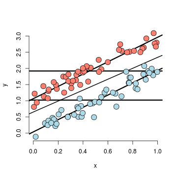
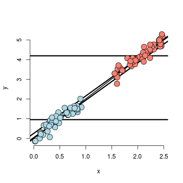
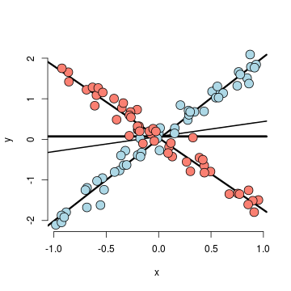
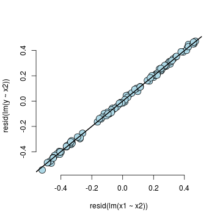
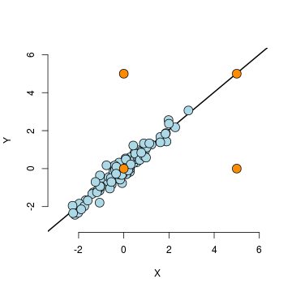
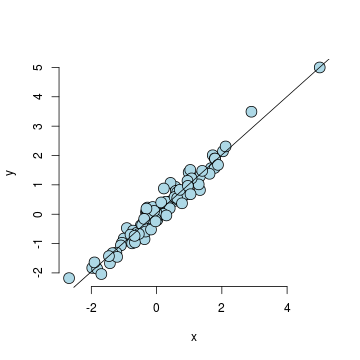

Regression Models
=================
*This note is a reorganization of Dr. Brian Caffo's lecture notes for the Coursera course [Regression Models](https://class.coursera.org/regmods-002).*

# Module II : Multivariable Regression

## Introduction

An insurance company is interested in how last year's claims can predict a person's time in the hospital this year. 

They want to use an enormous amount of data contained in claims to predict a single number. Simple linear regression (SLR) is not equipped to handle more than one predictor. Thus a *Multivariable regression* study tries to answer the questions
* How can one generalize SLR to incoporate lots of regressors for the purpose of prediction?
* What are the consequences of adding lots of regressors? 
* Surely there must be consequences to throwing variables in that aren't related to Y?
* Surely there must be consequences to omitting variables that are?

---
## General Linear Model
The general linear model extends SLR by adding terms linearly into the model as
$$
Y_i =  \beta_1 X_{1i} + \beta_2 X_{2i} + \ldots +
\beta_{p} X_{pi} + \epsilon_{i} 
= \sum_{k=1}^p \beta_k X_{ki}  + \epsilon_{i}
$$
When $X_{1i}=1$, an intercept is included. Least squares (and hence ML estimates under iid Gaussianity 
of the errors) minimizes
$$
\sum_{i=1}^n \left(Y_i - \sum_{k=1}^p \beta_k X_{ki}\right)^2
$$
We note that the important linearity is **linearity in the coefficients**. Thus $Y_i =  \beta_1 X_{1i}^2 + \beta_2 X_{2i}^2 + \ldots + \beta_{p} X_{pi}^2 + \epsilon_{i}$ is still a linear model. (We've just squared the elements of the
predictor variables.)

### SLR with Two Variables

Recall that the least squares (LS) estimate for regression through the origin in [Module I](http://rpubs.com/sialy/regmod-mod-1), $E[Y_i] = \beta_1 X_{1i}$, was $\beta_1 = \sum X_i Y_i / \sum X_i^2$.

Let's consider two regressors, $E[Y_i] = X_{1i}\beta_1 + X_{2i}\beta_2 = \mu_i$. Also recall that if $\hat \mu_i$ satisfies
$$
\sum_{i=1} (Y_i - \hat \mu_i) (\hat \mu_i - \mu_i) = 0
$$
for all possible values of $\mu_i$, then we've found the LS estimates.

$$
\sum_{i=1}^n (Y_i - \hat \mu_i) (\hat \mu_i - \mu_i) = \sum_{i=1}^n (Y_i - \hat \beta_1 X_{1i} - \hat \beta_2 X_{2i})
\left\{X_{1i}(\hat \beta_1 - \beta_1) + X_{2i}(\hat \beta_2 - \beta_2) \right\}
$$
Thus we need 
$$\sum_{i=1}^n (Y_i - \hat \beta_1 X_{1i} - \hat \beta_2 X_{2i}) X_{1i} = 0 ~~\mbox{ and }~~ \sum_{i=1}^n (Y_i - \hat \beta_1 X_{1i} - \hat \beta_2 X_{2i}) X_{2i} = 0$$

Hold $\hat \beta_1$ fixed in the second equation, we can get 
$$
\hat \beta_2 = \frac{\sum_{i=1} (Y_i - X_{1i}\hat \beta_1)X_{2i}}{\sum_{i=1}^n X_{2i}^2}
$$
Then we can substitute $\hat \beta_2$ in the first equation, we will get
$$
0 = \sum_{i=1}^n \left\{Y_i - \frac{\sum_j X_{2j}Y_j}{\sum_j X_{2j}^2}X_{2i} + 
\hat \beta_1 \left(X_{1i} - \frac{\sum_j X_{2j}X_{1j}}{\sum_j X_{2j}^2} X_{2i}\right)\right\} X_{1i}
= \sum_{i=1}^n \left\{ e_{i, Y | X_2} - \hat \beta_1 e_{i, X_1 | X_2} \right\} X_{1i}
$$
Where $e_{i, a | b} := a_i -  \frac{\sum_{j=1}^n a_j b_j }{\sum_{i=1}^n b_j^2} b_i$ is the residual when regressing $b$ from $a$ without an intercept. Now we get the solution
$$
\hat \beta_1 = \frac{\sum_{i=1}^n e_{i, Y | X_2} e_{i, X_1 | X_2}}{\sum_{i=1}^n e_{i, X_1 | X_2} X_1}
$$

But note that 
$$
\sum_{i=1}^n e_{i, X_1 | X_2}^2 
= \sum_{i=1}^n e_{i, X_1 | X_2} \left(X_{1i} - \frac{\sum_j X_{2j}X_{1j}}{\sum_j X_{2j}^2} X_{2i}\right)
= \sum_{i=1}^n e_{i, X_1 | X_2} X_{1i} - \frac{\sum_j X_{2j}X_{1j}}{\sum_j X_{2j}^2} \sum_{i=1}^n e_{i, X_1 | X_2} X_{2i}
= \sum_{i=1}^n e_{i, X_1 | X_2} X_{1i}
$$
Because $\sum_{i=1}^n e_{i, X_1 | X_2} X_{2i} = 0$. So finally we will have
$$
\hat \beta_1 = \frac{\sum_{i=1}^n e_{i, Y | X_2} e_{i, X_1 | X_2}}{\sum_{i=1}^n e_{i, X_1 | X_2}^2}
$$

**Discussion.**

* The result shows that the regression estimate for $\beta_1$ is the regression through the origin estimate having regressed $X_2$ out of both the response and the predictor.
* Similarly, the regression estimate for $\beta_2$ is the regression through the origin estimate having regressed $X_1$ out of both the response and the predictor.
* More generally, multivariate regression estimates are exactly those having removed the linear relationship of the other variables from both the regressor and response.

**Example.** Consider $Y_{i} = \beta_1 X_{1i} + \beta_2 X_{2i}$ where $X_{2i} = 1$ is an intercept term. Then $\frac{\sum_j X_{2j}X_{1j}}{\sum_j X_{2j}^2}X_{2i} = \frac{\sum_j X_{1j}}{n} = \bar X_1$ and $e_{i, X_1 | X_2} = X_{1i} - \bar X_1$. Simiarly $e_{i, Y | X_2} = Y_i - \bar Y$. Thus
$$
\hat \beta_1 = \frac{\sum_{i=1}^n e_{i, Y | X_2} e_{i, X_1 | X_2}}{\sum_{i=1}^n e_{i, X_1 | X_2}^2} = \frac{\sum_{i=1}^n (X_i - \bar X)(Y_i - \bar Y)}{\sum_{i=1}^n (X_i - \bar X)^2}
= Cor(X, Y) \frac{Sd(Y)}{Sd(X)}
$$

### General SLR
Similarly, for the general case, we need to solve the equations
$$
\sum_{i=1}^n (Y_i -\beta_1 X_{1i} - \beta_2 X_{2i} - \ldots - \beta_{p} X_{pi}) X_{ki} = 0
$$
for $k = 1, \ldots, p$ yields $p$ equations with $p$ unknowns.
* Solving them yields the least squares estimates. (With obtaining a good, fast, general solution requiring some knowledge of linear algebra.)
* The least squares estimate for the coefficient of a multivariate regression model is exactly regression through the origin with the linear relationships with the other regressors removed from both the regressor and outcome by taking residuals. 
* In this sense, multivariate regression "adjusts" a coefficient for the linear impact of the other variables. 

**Analysis.**

Just so I don't leave you hanging, let's show a way to get estimates. Recall the equations:
$$
\sum_{i=1}^n (Y_i - X_{1i}\hat \beta_1 - \ldots - X_{pi}\hat \beta_p) X_{ki} = 0
$$
Hold $\hat \beta_1, \ldots, \hat \beta_{p-1}$ fixed then
we get that
$$
\hat \beta_p = \frac{\sum_{i=1}^n (Y_i - X_{1i}\hat \beta_1 - \ldots - X_{p-1,i}\hat \beta_{p-1}) X_{pi} }{\sum_{i=1}^n X_{ip}^2}
$$
Then we can substitute them back into the equations, we wind up with 
$$
\sum_{i=1}^n (e_{i,Y|X_p} - e_{i, X_{1} | X_p} \hat \beta_1 - \ldots - e_{i, X_{p-1} | X_{p}} \hat \beta_{p-1}) X_k = 0
$$
Note that
$$
X_k  = e_{i,X_k|X_p} + \frac{\sum_{i=1}^n X_{ik} X_{ip}}{\sum_{i=1}^n X_{ip^2}} X_p
$$
and $\sum_{i=1}^n e_{i,X_j | X_p} X_{ip} = 0$.
Thus 
$$
\sum_{i=1}^n (e_{i,Y|X_p} - e_{i, X_{1} | X_p} \hat \beta_1 - \ldots - e_{i, X_{p-1} | X_{p}} \hat \beta_{p-1}) X_k 
= \sum_{i=1}^n (e_{i,Y|X_p} - e_{i, X_{1} | X_p} \hat \beta_1 - \ldots - e_{i, X_{p-1} | X_{p}} \hat \beta_{p-1}) e_{i,X_k|X_p} 
= 0
$$

### Summary
We have reduced $p$ LS equations and $p$ unknowns to $p-1$ LS equations and $p-1$ unknowns.
  * Every variable has been replaced by its residual with $X_p$. 
  * This process can then be iterated until only $Y$ and one variable remains. 
  * Think of it as follows. If we want an adjusted relationship between $Y$ and $X$, keep taking residuals over confounders and do regression through the origin.
  * The order that you do the confounders doesn't matter.
  * This isn't a terribly efficient way to get estimates. But, it's nice conceputally, as it shows how regression estimates are adjusted for the linear relationship with other variables.

### Example

```r
n <- 100
x <- rnorm(n)
x2 <- rnorm(n)
x3 <- rnorm(n)
y <- x + x2 + x3 + rnorm(n, sd = 0.1)
e <- function(a, b) a - sum(a * b)/sum(b^2) * b  # Calculate the residual
ey <- e(e(y, x2), e(x3, x2))
ex <- e(e(x, x2), e(x3, x2))
sum(ey * ex)/sum(ex^2)
```

```
## [1] 0.998
```

```r
summary(lm(y ~ x + x2 + x3 - 1))$coefficients  # The -1 removes the intercept term
```

```
##    Estimate Std. Error t value   Pr(>|t|)
## x    0.9980   0.009301   107.3 1.324e-102
## x2   0.9955   0.008465   117.6 1.934e-106
## x3   0.9796   0.008982   109.1 2.764e-103
```

Let's show that order doesn't matter

```r
ey <- e(e(y, x3), e(x2, x3))
ex <- e(e(x, x3), e(x2, x3))
sum(ey * ex)/sum(ex^2)
```

```
## [1] 0.998
```

```r
coef(lm(y ~ x + x2 + x3 - 1))  # The -1 removes the intercept term
```

```
##      x     x2     x3 
## 0.9980 0.9955 0.9796
```


We can calculate the residual

```r
ey <- resid(lm(y ~ x2 + x3 - 1))
ex <- resid(lm(x ~ x2 + x3 - 1))
sum(ey * ex)/sum(ex^2)
```

```
## [1] 0.998
```

```r
coef(lm(y ~ x + x2 + x3 - 1))  #the -1 removes the intercept term
```

```
##      x     x2     x3 
## 0.9980 0.9955 0.9796
```


We can also try to interprete the coefficients
$$E[Y | X_1 = x_1, \ldots, X_p = x_p] = \sum_{k=1}^p x_{k} \beta_k$$
So that
$$
E[Y | X_1 = x_1 + 1, \ldots, X_p = x_p]  - E[Y | X_1 = x_1, \ldots, X_p = x_p]$$
$$= (x_1 + 1) \beta_1 + \sum_{k=2}^p x_{k}+ \sum_{k=1}^p x_{k} \beta_k = \beta_1 $$
So that the interpretation of a multivariate regression coefficient is the expected change in **the response per unit change** in the regressor, holding all of the other regressors fixed.

All of our SLR quantities can be extended to linear models
* Model $Y_i = \sum_{k=1}^p X_{ik} \beta_{k} + \epsilon_{i}$ where $\epsilon_i \sim N(0, \sigma^2)$
* Fitted responses $\hat Y_i = \sum_{k=1}^p X_{ik} \hat \beta_{k}$
* Residuals $e_i = Y_i - \hat Y_i$
* Variance estimate $\hat \sigma^2 = \frac{1}{n-p} \sum_{i=1}^n e_i ^2$
* To get predicted responses at new values, $x_1, \ldots, x_p$, simply plug them into the linear model $\sum_{k=1}^p x_{k} \hat \beta_{k}$
* Coefficients have standard errors, $\hat \sigma_{\hat \beta_k}$, and
$\frac{\hat \beta_k - \beta_k}{\hat \sigma_{\hat \beta_k}}$
follows a $T$ distribution with $n-p$ degrees of freedom.
* Predicted responses have standard errors and we can calculate predicted and expected response intervals.

### Linear models
Linear models are the single most important applied statistical and machine learning techniqe *by far*, some amazing things that you can accomplish with linear models
  * Decompose a signal into its harmonics.
  * Flexibly fit complicated functions.
  * Fit factor variables as predictors.
  * Uncover complex multivariate relationships with the response.
  * Build accurate prediction models.
  
---
## Multivariable Regression Examples
Let's take a look at the *Swiss fertility data*

```r
require(stats)
require(graphics)
library(datasets)
data(swiss)
pairs(swiss, panel = panel.smooth, main = "Swiss data", col = 3 + (swiss$Catholic > 
    50))
```

 

The dataset `swiss` contains 47 observations on 6 variables, each of which is in percent, i.e., in [0, 100].

* [,1]   Fertility    Ig, ‘ common standardized fertility measure’
* [,2]	 Agriculture	 % of males involved in agriculture as occupation
* [,3]	 Examination	 % draftees receiving highest mark on army examination
* [,4]	 Education	 % education beyond primary school for draftees.
* [,5]	 Catholic	 % ‘catholic’ (as opposed to ‘protestant’).
* [,6]	 Infant.Mortality	 live births who live less than 1 year.

All variables but ‘Fertility’ give proportions of the population.


```r
summary(lm(Fertility ~ ., data = swiss))$coefficients
```

```
##                  Estimate Std. Error t value  Pr(>|t|)
## (Intercept)       66.9152   10.70604   6.250 1.906e-07
## Agriculture       -0.1721    0.07030  -2.448 1.873e-02
## Examination       -0.2580    0.25388  -1.016 3.155e-01
## Education         -0.8709    0.18303  -4.758 2.431e-05
## Catholic           0.1041    0.03526   2.953 5.190e-03
## Infant.Mortality   1.0770    0.38172   2.822 7.336e-03
```

We can interprete the result as
* Agriculture is expressed in percentages (0 - 100)
* Estimate is -0.1721.
* We estimate an expected 0.17 decrease in standardized fertility for every 1\% increase in percentage of males involved in agriculture in holding the remaining variables constant.
* The t-test for $H_0: \beta_{Agri} = 0$ versus $H_a: \beta_{Agri} \neq 0$ is  significant.
* Interestingly, the unadjusted estimate is 

```r
summary(lm(Fertility ~ Agriculture, data = swiss))$coefficients
```

```
##             Estimate Std. Error t value  Pr(>|t|)
## (Intercept)  60.3044    4.25126  14.185 3.216e-18
## Agriculture   0.1942    0.07671   2.532 1.492e-02
```


### How can adjustment reverse the sign of an effect? 

Let's try a simulation.

```r
n <- 100
x2 <- 1:n
x1 <- 0.01 * x2 + runif(n, -0.1, 0.1)
y = -x1 + x2 + rnorm(n, sd = 0.01)
summary(lm(y ~ x1))$coef
```

```
##             Estimate Std. Error t value  Pr(>|t|)
## (Intercept)    1.663      1.176   1.415 1.604e-01
## x1            97.097      2.044  47.507 1.809e-69
```

```r
summary(lm(y ~ x1 + x2))$coef
```

```
##              Estimate Std. Error   t value   Pr(>|t|)
## (Intercept) -0.001711  0.0018666   -0.9169  3.615e-01
## x1          -1.035762  0.0159070  -65.1134  7.382e-82
## x2           1.000381  0.0001588 6298.9104 5.458e-274
```


```r
par(mfrow = c(1, 2))
plot(x1, y, pch = 21, col = "black", bg = topo.colors(n)[x2], frame = FALSE, 
    cex = 1.5)
title("Unadjusted, color is X2")
abline(lm(y ~ x1), lwd = 2)
plot(resid(lm(x1 ~ x2)), resid(lm(y ~ x2)), pch = 21, col = "black", bg = "lightblue", 
    frame = FALSE, cex = 1.5)
title("Adjusted")
abline(0, coef(lm(y ~ x1 + x2))[2], lwd = 2)
```

 

If we go back to this data set, we note that
* The sign reverses itself with the inclusion of Examination and Education, but of which are negatively correlated with Agriculture.
* The percent of males in the province working in agriculture is negatively related to educational attainment (correlation of -0.6395) and Education and Examination (correlation of 0.6984) are obviously measuring similar things. 
  * Is the positive marginal an artifact for not having accounted for, say, Education level? (Education does have a stronger effect, by the way.)
* At the minimum, anyone claiming that provinces that are more agricultural have higher fertility rates would immediately be open to criticism.

### What if we include an unnecessary variable?
z adds no new linear information, since it's a linear combination of variables already included. R just drops 
terms that are linear combinations of other terms.

```r
z <- swiss$Agriculture + swiss$Education
lm(Fertility ~ . + z, data = swiss)
```

```
## 
## Call:
## lm(formula = Fertility ~ . + z, data = swiss)
## 
## Coefficients:
##      (Intercept)       Agriculture       Examination         Education  
##           66.915            -0.172            -0.258            -0.871  
##         Catholic  Infant.Mortality                 z  
##            0.104             1.077                NA
```


### Dummy Variables
Sometimes dummy variables are smart. Consider the linear model $Y_i = \beta_0 + X_{i1} \beta_1 + \epsilon_{i}$ where each $X_{i1}$ is binary so that it is a $1$ if measurement $i$ is in a group and $0$ otherwise. 

Then for people in the group $E[Y_i] = \beta_0 + \beta_1$ and for people not in the group $E[Y_i] = \beta_0$. The LS fits work out to be $\hat \beta_0 + \hat \beta_1$ is the mean for those in the group and $\hat \beta_0$ is the mean for those not in the group.
* $\beta_1$ is interpretted as the increase or decrease in the mean comparing those in the group to those not.
* Note including a binary variable that is 1 for those not in the group would be redundant. It would create three parameters to describe two means.

**More than 2 levels.**

Consider a multilevel factor level. For didactic reasons, let's say a three level factor (example, US political party affiliation: Republican, Democrat, Independent)
* $Y_i = \beta_0 + X_{i1} \beta_1 + X_{i2} \beta_2 + \epsilon_i$.
* $X_{i1}$ is 1 for Republicans and 0 otherwise.
* $X_{i2}$ is 1 for Democrats and 0 otherwise.
* If $i$ is Republican $E[Y_i] = \beta_0 +\beta_1$
* If $i$ is Democrat $E[Y_i] = \beta_0 + \beta_2$.
* If $i$ is Independent $E[Y_i] = \beta_0$. 
* $\beta_1$ compares Republicans to Independents.
* $\beta_2$ compares Democrats to Independents.
* $\beta_1 - \beta_2$ compares Republicans to Democrats.
* (Choice of reference category changes the interpretation.)

### Another example with the dataset `InsectSprays`
The data frame `InsectSprays` contains **72** on **2** variables
* [,1]  count  numeric  Insect count
* [,2]  spray  factor   The type of spray


```r
data(InsectSprays)
str(InsectSprays)
```

```
## 'data.frame':	72 obs. of  2 variables:
##  $ count: num  10 7 20 14 14 12 10 23 17 20 ...
##  $ spray: Factor w/ 6 levels "A","B","C","D",..: 1 1 1 1 1 1 1 1 1 1 ...
```

```r
boxplot(count ~ spray, data = InsectSprays, xlab = "Type of spray", ylab = "Insect count", 
    main = "InsectSprays data", varwidth = TRUE, col = "lightgray")
```

 


If we take the group A as the reference, the linear model fit will be 

```r
summary(lm(count ~ spray, data = InsectSprays))$coef
```

```
##             Estimate Std. Error t value  Pr(>|t|)
## (Intercept)  14.5000      1.132 12.8074 1.471e-19
## sprayB        0.8333      1.601  0.5205 6.045e-01
## sprayC      -12.4167      1.601 -7.7550 7.267e-11
## sprayD       -9.5833      1.601 -5.9854 9.817e-08
## sprayE      -11.0000      1.601 -6.8702 2.754e-09
## sprayF        2.1667      1.601  1.3532 1.806e-01
```


Hard coding the dummy variables

```r
summary(lm(count ~ I(1 * (spray == "B")) + I(1 * (spray == "C")) + I(1 * (spray == 
    "D")) + I(1 * (spray == "E")) + I(1 * (spray == "F")), data = InsectSprays))$coef
```

```
##                       Estimate Std. Error t value  Pr(>|t|)
## (Intercept)            14.5000      1.132 12.8074 1.471e-19
## I(1 * (spray == "B"))   0.8333      1.601  0.5205 6.045e-01
## I(1 * (spray == "C")) -12.4167      1.601 -7.7550 7.267e-11
## I(1 * (spray == "D"))  -9.5833      1.601 -5.9854 9.817e-08
## I(1 * (spray == "E")) -11.0000      1.601 -6.8702 2.754e-09
## I(1 * (spray == "F"))   2.1667      1.601  1.3532 1.806e-01
```


What if we include all 6?

```r
lm(count ~ I(1 * (spray == "B")) + I(1 * (spray == "C")) + I(1 * (spray == "D")) + 
    I(1 * (spray == "E")) + I(1 * (spray == "F")) + I(1 * (spray == "A")), data = InsectSprays)
```

```
## 
## Call:
## lm(formula = count ~ I(1 * (spray == "B")) + I(1 * (spray == 
##     "C")) + I(1 * (spray == "D")) + I(1 * (spray == "E")) + I(1 * 
##     (spray == "F")) + I(1 * (spray == "A")), data = InsectSprays)
## 
## Coefficients:
##           (Intercept)  I(1 * (spray == "B"))  I(1 * (spray == "C"))  
##                14.500                  0.833                -12.417  
## I(1 * (spray == "D"))  I(1 * (spray == "E"))  I(1 * (spray == "F"))  
##                -9.583                -11.000                  2.167  
## I(1 * (spray == "A"))  
##                    NA
```


What if we omit the intercept?

```r
summary(lm(count ~ spray - 1, data = InsectSprays))$coef
```

```
##        Estimate Std. Error t value  Pr(>|t|)
## sprayA   14.500      1.132  12.807 1.471e-19
## sprayB   15.333      1.132  13.543 1.002e-20
## sprayC    2.083      1.132   1.840 7.024e-02
## sprayD    4.917      1.132   4.343 4.953e-05
## sprayE    3.500      1.132   3.091 2.917e-03
## sprayF   16.667      1.132  14.721 1.573e-22
```

```r
unique(ave(InsectSprays$count, InsectSprays$spray))
```

```
## [1] 14.500 15.333  2.083  4.917  3.500 16.667
```


We note that
* If we treat Spray as a factor, R includes an intercept and omits the alphabetically first level of the factor.
  * All t-tests are for comparisons of Sprays versus Spray A.
  * Emprirical mean for A is the intercept.
  * Other group means are the itc plus their coefficient. 
* If we omit an intercept, then it includes terms for all levels of the factor. 
  * Group means are the coefficients. 
  * Tests are tests of whether the groups are different than zero. (Are the expected counts zero for that spray.)

If we want comparisons between, Spray B and C, say we could refit the model with C (or B) as the reference level. For example

```r
spray2 <- relevel(InsectSprays$spray, "C")
summary(lm(count ~ spray2, data = InsectSprays))$coef
```

```
##             Estimate Std. Error t value  Pr(>|t|)
## (Intercept)    2.083      1.132  1.8401 7.024e-02
## spray2A       12.417      1.601  7.7550 7.267e-11
## spray2B       13.250      1.601  8.2755 8.510e-12
## spray2D        2.833      1.601  1.7696 8.141e-02
## spray2E        1.417      1.601  0.8848 3.795e-01
## spray2F       14.583      1.601  9.1083 2.794e-13
```


We can also do it manually
$$Var(\hat \beta_B - \hat \beta_C) = Var(\hat \beta_B) + Var(\hat \beta_C) - 2 Cov(\hat \beta_B, \hat \beta_C)$$

```r
fit <- lm(count ~ spray, data = InsectSprays)  #A is ref
bbmbc <- coef(fit)[2] - coef(fit)[3]  #B - C
temp <- summary(fit)
se <- temp$sigma * sqrt(temp$cov.unscaled[2, 2] + temp$cov.unscaled[3, 3] - 
    2 * temp$cov.unscaled[2, 3])
t <- (bbmbc)/se
p <- pt(-abs(t), df = fit$df)
out <- c(bbmbc, se, t, p)
names(out) <- c("B - C", "SE", "T", "P")
round(out, 3)
```

```
##  B - C     SE      T      P 
## 13.250  1.601  8.276  0.000
```


**Some other thoughts on this data.**

* Counts are bounded from below by 0, violates the assumption of normality of the errors. 
  * Also there are counts near zero, so both the actual assumption and the intent of the assumption are violated.
* Variance does not appear to be constant.
* Perhaps taking logs of the counts would help. 
  * There are 0 counts, so maybe log(Count + 1)
* Also, we'll cover Poisson GLMs for fitting count data.

---
## Adjustment

### Simulation 1

```r
n <- 100
t <- rep(c(0, 1), c(n/2, n/2))
x <- c(runif(n/2), runif(n/2))
beta0 <- 0
beta1 <- 2
tau <- 1
sigma <- 0.2
y <- beta0 + x * beta1 + t * tau + rnorm(n, sd = sigma)
plot(x, y, type = "n", frame = FALSE)
abline(lm(y ~ x), lwd = 2)
abline(h = mean(y[1:(n/2)]), lwd = 3)
abline(h = mean(y[(n/2 + 1):n]), lwd = 3)
fit <- lm(y ~ x + t)
abline(coef(fit)[1], coef(fit)[2], lwd = 3)
abline(coef(fit)[1] + coef(fit)[3], coef(fit)[2], lwd = 3)
points(x[1:(n/2)], y[1:(n/2)], pch = 21, col = "black", bg = "lightblue", cex = 2)
points(x[(n/2 + 1):n], y[(n/2 + 1):n], pch = 21, col = "black", bg = "salmon", 
    cex = 2)
```

 


**Discussion.**

* The X variable is unrelated to group status
* The X variable is related to Y, but the intercept depends
  on group status.
* The group variable is related to Y.
  * The relationship between group status and Y is constant depending on X.
  * The relationship between group and Y disregarding X is about the same as holding X constant

### Simulation 2

```r
n <- 100
t <- rep(c(0, 1), c(n/2, n/2))
x <- c(runif(n/2), 1.5 + runif(n/2))
beta0 <- 0
beta1 <- 2
tau <- 0
sigma <- 0.2
y <- beta0 + x * beta1 + t * tau + rnorm(n, sd = sigma)
plot(x, y, type = "n", frame = FALSE)
abline(lm(y ~ x), lwd = 2)
abline(h = mean(y[1:(n/2)]), lwd = 3)
abline(h = mean(y[(n/2 + 1):n]), lwd = 3)
fit <- lm(y ~ x + t)
abline(coef(fit)[1], coef(fit)[2], lwd = 3)
abline(coef(fit)[1] + coef(fit)[3], coef(fit)[2], lwd = 3)
points(x[1:(n/2)], y[1:(n/2)], pch = 21, col = "black", bg = "lightblue", cex = 2)
points(x[(n/2 + 1):n], y[(n/2 + 1):n], pch = 21, col = "black", bg = "salmon", 
    cex = 2)
```

 


**Discussion.**

* The X variable is highly related to group status
* The X variable is related to Y, the intercept
  doesn't depend on the group variable.
  * The X variable remains related to Y holding group status constant
* The group variable is marginally related to Y disregarding X.
* The model would estimate no adjusted effect due to group. 
  * There isn't any data to inform the relationship between
    group and Y.
  * This conclusion is entirely based on the model. 

### Simulation 3

```r
n <- 100
t <- rep(c(0, 1), c(n/2, n/2))
x <- c(runif(n/2), 0.9 + runif(n/2))
beta0 <- 0
beta1 <- 2
tau <- -1
sigma <- 0.2
y <- beta0 + x * beta1 + t * tau + rnorm(n, sd = sigma)
plot(x, y, type = "n", frame = FALSE)
abline(lm(y ~ x), lwd = 2)
abline(h = mean(y[1:(n/2)]), lwd = 3)
abline(h = mean(y[(n/2 + 1):n]), lwd = 3)
fit <- lm(y ~ x + t)
abline(coef(fit)[1], coef(fit)[2], lwd = 3)
abline(coef(fit)[1] + coef(fit)[3], coef(fit)[2], lwd = 3)
points(x[1:(n/2)], y[1:(n/2)], pch = 21, col = "black", bg = "lightblue", cex = 2)
points(x[(n/2 + 1):n], y[(n/2 + 1):n], pch = 21, col = "black", bg = "salmon", 
    cex = 2)
```

 


**Discussion.**

* Marginal association has red group higher than blue.
* Adjusted relationship has blue group higher than red.
* Group status related to X.
* There is some direct evidence for comparing red and blue
holding X fixed.

### Simulation 4

```r
n <- 100
t <- rep(c(0, 1), c(n/2, n/2))
x <- c(0.5 + runif(n/2), runif(n/2))
beta0 <- 0
beta1 <- 2
tau <- 1
sigma <- 0.2
y <- beta0 + x * beta1 + t * tau + rnorm(n, sd = sigma)
plot(x, y, type = "n", frame = FALSE)
abline(lm(y ~ x), lwd = 2)
abline(h = mean(y[1:(n/2)]), lwd = 3)
abline(h = mean(y[(n/2 + 1):n]), lwd = 3)
fit <- lm(y ~ x + t)
abline(coef(fit)[1], coef(fit)[2], lwd = 3)
abline(coef(fit)[1] + coef(fit)[3], coef(fit)[2], lwd = 3)
points(x[1:(n/2)], y[1:(n/2)], pch = 21, col = "black", bg = "lightblue", cex = 2)
points(x[(n/2 + 1):n], y[(n/2 + 1):n], pch = 21, col = "black", bg = "salmon", 
    cex = 2)
```

 


**Discussion.**

* No marginal association between group status and Y.
* Strong adjusted relationship.
* Group status not related to X.
* There is lots of direct evidence for comparing red and blue
holding X fixed.

### Simulation 5

```r
n <- 100
t <- rep(c(0, 1), c(n/2, n/2))
x <- c(runif(n/2, -1, 1), runif(n/2, -1, 1))
beta0 <- 0
beta1 <- 2
tau <- 0
tau1 <- -4
sigma <- 0.2
y <- beta0 + x * beta1 + t * tau + t * x * tau1 + rnorm(n, sd = sigma)
plot(x, y, type = "n", frame = FALSE)
abline(lm(y ~ x), lwd = 2)
abline(h = mean(y[1:(n/2)]), lwd = 3)
abline(h = mean(y[(n/2 + 1):n]), lwd = 3)
fit <- lm(y ~ x + t + I(x * t))
abline(coef(fit)[1], coef(fit)[2], lwd = 3)
abline(coef(fit)[1] + coef(fit)[3], coef(fit)[2] + coef(fit)[4], lwd = 3)
points(x[1:(n/2)], y[1:(n/2)], pch = 21, col = "black", bg = "lightblue", cex = 2)
points(x[(n/2 + 1):n], y[(n/2 + 1):n], pch = 21, col = "black", bg = "salmon", 
    cex = 2)
```

 


**Discussion.**

* There is no such thing as a group effect here. 
  * The impact of group reverses itself depending on X.
  * Both intercept and slope depends on group.
* Group status and X unrelated.
  * There's lots of information about group effects holding X fixed.

### Simulation 6
 


We will do this to investigate the bivariate relationship
```
library(rgl)
plot3d(x1, x2, y)
```

**Residual relationship**

```r
plot(resid(lm(x1 ~ x2)), resid(lm(y ~ x2)), frame = FALSE, col = "black", bg = "lightblue", 
    pch = 21, cex = 2)
abline(lm(I(resid(lm(x1 ~ x2))) ~ I(resid(lm(y ~ x2)))), lwd = 2)
```

 


**Discussion.**

* X1 unrelated to X2
* X2 strongly related to Y
* Adjusted relationship between X1 and Y largely unchanged
  by considering X2.
  * Almost no residual variability after accounting for X2.

### Some final thoughts
* Modeling multivariate relationships is difficult.
* Play around with simulations to see how the inclusion or exclustion of another variable can change analyses.
* The results of these analyses deal with the impact of variables on associations.
  * Ascertaining mechanisms or cause are difficult subjects to be added on top of difficulty in understanding multivariate associations.
  
---
## Residuals, diagnostics, variation

Consider $Y_i =  \sum_{k=1}^p X_{ik} \beta_j + \epsilon_{i}$. We'll also assume here that $\epsilon_i \stackrel{iid}{\sim} N(0, \sigma^2)$ and define the residuals as $e_i = Y_i -  \hat Y_i =  Y_i - \sum_{k=1}^p X_{ik} \hat \beta_j$

Our estimate of residual variation is $\hat \sigma^2 = \frac{\sum_{i=1}^n e_i^2}{n-p}$, the $n-p$ so that $E[\hat \sigma^2] = \sigma^2$


```r
data(swiss)
par(mfrow = c(2, 2))
fit <- lm(Fertility ~ ., data = swiss)
plot(fit)
```

 


**Influential, high leverage and outlying points plot**

```r
n <- 100
x <- rnorm(n)
y <- x + rnorm(n, sd = 0.3)
plot(c(-3, 6), c(-3, 6), type = "n", frame = FALSE, xlab = "X", ylab = "Y")
abline(lm(y ~ x), lwd = 2)
points(x, y, cex = 2, bg = "lightblue", col = "black", pch = 21)
points(0, 0, cex = 2, bg = "darkorange", col = "black", pch = 21)
points(0, 5, cex = 2, bg = "darkorange", col = "black", pch = 21)
points(5, 5, cex = 2, bg = "darkorange", col = "black", pch = 21)
points(5, 0, cex = 2, bg = "darkorange", col = "black", pch = 21)
```

 


Calling a point an outlier is vague. 
  * Outliers can be the result of spurious or real processes.
  * Outliers can have varying degrees of influence.
  * Outliers can conform to the regression relationship (i.e being marginally outlying in X or Y, but not outlying given the regression relationship).
* Upper left hand point has low leverage, low influence, outlies in a way not conforming to the regression relationship.
* Lower left hand point has low leverage, low influence and is not to be an outlier in any sense.
* Upper right hand point has high leverage, but chooses not to extert it and thus would have low actual influence by conforming to the regresison relationship of the other points.
* Lower right hand point has high leverage and would exert it if it were included in the fit.

### Influence measures
Do `?influence.measures` to see the full suite of influence measures in stats. The measures include
  * `rstandard` - standardized residuals, residuals divided by their standard deviations)
  * `rstudent` - standardized residuals, residuals divided by their standard deviations, where the ith data point was deleted in the calculation of the standard deviation for the residual to follow a t distribution
  * `hatvalues` - measures of leverage
  * `dffits` - change in the predicted response when the $i^{th}$ point is deleted in fitting the model.
  * `dfbetas` - change in individual coefficients when the $i^{th}$ point is deleted in fitting the model.
  * `cooks.distance` - overall change in teh coefficients when the $i^{th}$ point is deleted.
  * `resid` - returns the ordinary residuals
  * `resid(fit) / (1 - hatvalues(fit))` where `fit` is the linear model fit returns the PRESS residuals, i.e. the leave one out cross validation residuals - the difference in the response and the predicted response at data point $i$, where it was not included in the model fitting.

How to use all of these things?

* Be wary of simplistic rules for diagnostic plots and measures. The use of these tools is context specific. It's better to understand what they are trying to accomplish and use them judiciously.
* Not all of the measures have meaningful absolute scales. You can look at them relative to the values across the data.
* They probe your data in different ways to diagnose different problems. 
* Patterns in your residual plots generally indicate some poor aspect of model fit. These can include:
  * Heteroskedasticity (non constant variance).
  * Missing model terms.
  * Temporal patterns (plot residuals versus collection order).
* Residual QQ plots investigate normality of the errors.
* Leverage measures (hat values) can be useful for diagnosing data entry errors.
* Influence measures get to the bottom line, 'how does deleting or including this point impact a particular aspect of the model'.

### Examples
**Case 1**

```r
x <- c(10, rnorm(n))
y <- c(10, c(rnorm(n)))
plot(x, y, frame = FALSE, cex = 2, pch = 21, bg = "lightblue", col = "black")
abline(lm(y ~ x))
```

 


```r
n <- 100
x <- c(10, rnorm(n))
y <- c(10, c(rnorm(n)))
plot(x, y, frame = FALSE, cex = 2, pch = 21, bg = "lightblue", col = "black")
abline(lm(y ~ x))
```

 

We notice that the point `c(10, 10)` has created a strong regression relationship where there shouldn't be one.

---
## Showing a couple of the diagnostic values

```r
fit <- lm(y ~ x)
round(dfbetas(fit)[1:10, 2], 3)
```

```
##      1      2      3      4      5      6      7      8      9     10 
##  7.417 -0.030 -0.172 -0.300 -0.228  0.044  0.022 -0.015  0.010 -0.054
```

```r
round(hatvalues(fit)[1:10], 3)
```

```
##     1     2     3     4     5     6     7     8     9    10 
## 0.498 0.012 0.029 0.033 0.024 0.012 0.017 0.010 0.015 0.012
```


**Case 2**

```r
x <- rnorm(n)
y <- x + rnorm(n, sd = 0.3)
x <- c(5, x)
y <- c(5, y)
plot(x, y, frame = FALSE, cex = 2, pch = 21, bg = "lightblue", col = "black")
fit2 <- lm(y ~ x)
abline(fit2)
```

 


Look at some of the diagnostics

```r
round(dfbetas(fit2)[1:10, 2], 3)
```

```
##      1      2      3      4      5      6      7      8      9     10 
##  0.005  0.139 -0.089  0.041 -0.003  0.086  0.143 -0.066 -0.005 -0.010
```

```r
round(hatvalues(fit2)[1:10], 3)
```

```
##     1     2     3     4     5     6     7     8     9    10 
## 0.199 0.014 0.057 0.037 0.010 0.035 0.016 0.013 0.010 0.010
```


**Example described by Stefanski TAS 2007 Vol 61.**

```r
## Don't everyone hit this server at once.  Read the paper first.
dat <- read.table("http://www4.stat.ncsu.edu/~stefanski/NSF_Supported/Hidden_Images/orly_owl_files/orly_owl_Lin_4p_5_flat.txt", 
    header = FALSE)
pairs(dat)
```

 


If we got our P-values, should we bother to do a residual plot?

```r
summary(lm(V1 ~ . - 1, data = dat))$coef
```

```
##    Estimate Std. Error t value  Pr(>|t|)
## V2   0.9856    0.12798   7.701 1.989e-14
## V3   0.9715    0.12664   7.671 2.500e-14
## V4   0.8606    0.11958   7.197 8.301e-13
## V5   0.9267    0.08328  11.127 4.778e-28
```


This is the residual plot, p-values significant, O RLY?

```r
fit <- lm(V1 ~ . - 1, data = dat)
plot(predict(fit), resid(fit), pch = ".")
```

 


---
## Multivariable Regression

We have an entire class on prediction and machine learning, so we'll focus on modeling. Prediction has a different set of criteria, needs for interpretability and standards for generalizability. In modeling, our interest lies in parsimonious, interpretable representations of the data that enhance our understanding of the phenomena under study.

> A model is a lense through which to look at your data. (Scott Zeger)

Under this philosophy, what's the right model? Whatever model connects the data to a true, parsimonious statement about what you're studying. There are nearly uncontable ways that a model can be wrong, in this lecture, we'll focus on variable inclusion and exclusion. Like nearly all aspects of statistics, good modeling decisions are context dependent. A good model for prediction versus one for studying mechanisms versus one for trying to establish causal effects may not be the same.

> There are known knowns. These are things we know that we know. There are known unknowns. That is to say, there are things that we know we don't know. But there are also unknown unknowns. There are things we don't know we don't know. (Donald Rumsfeld)

In our context
* (Known knowns) Regressors that we know we should check to include in the model and have.
* (Known Unknowns) Regressors that we would like to include in the model, but don't have.
* (Unknown Unknowns) Regressors that we don't even know about that we should have included in the model.

### General Rules for multivariable regression
* Omitting variables results in bias in the coeficients of interest - unless their regressors are uncorrelated with the omitted ones.
  * This is why we randomize treatments, it attempts to uncorrelate our treatment indicator with variables that we don't have to put in the model. If there's too many unobserved confounding variables, even randomization won't help you.
* Including variables that we shouldn't have increases standard errors of the regression variables.
  * Actually, including any new variables increasese (actual, not estimated) standard errors of other regressors. So we don't want to idly throw variables into the model.
* The model must tend toward perfect fit as the number of non-redundant regressors approaches $n$.
* $R^2$ increases monotonically as more regressors are included.
* The SSE decreases monotonically as more regressors are included.

We could plot of $R^2$ versus $n$. For simulations as the number of variables included equals increases to $n=100$. 
No actual regression relationship exist in any simulation

```r
n <- 100
plot(c(1, n), 0:1, type = "n", frame = FALSE, xlab = "p", ylab = "R^2")
r <- sapply(1:n, function(p) {
    y <- rnorm(n)
    x <- matrix(rnorm(n * p), n, p)
    summary(lm(y ~ x))$r.squared
})
lines(1:n, r, lwd = 2)
abline(h = 1)
```

 


### Variance inflation

```r
n <- 100
nosim <- 1000
x1 <- rnorm(n)
x2 <- rnorm(n)
x3 <- rnorm(n)
betas <- sapply(1:nosim, function(i) {
    y <- x1 + rnorm(n, sd = 0.3)
    c(coef(lm(y ~ x1))[2], coef(lm(y ~ x1 + x2))[2], coef(lm(y ~ x1 + x2 + x3))[2])
})
round(apply(betas, 1, sd), 5)
```

```
##      x1      x1      x1 
## 0.03433 0.03444 0.03481
```


The variance inflation factors include
* Notice variance inflation was much worse when we included a variable that was highly related to `x1`. 
* We don't know $\sigma$, so we can only estimate the increase in the actual standard error of the coefficients for including a regressor.
* However, $\sigma$ drops out of the relative standard errors. If one sequentially adds variables, one can check the variance (or sd) inflation for including each one.
* When the other regressors are actually orthogonal to the regressor of interest, then there is no variance inflation.
* The variance inflation factor (VIF) is the increase in the variance for the ith regressor compared to the ideal setting where it is orthogonal to the other regressors.
  * (The square root of the VIF is the increase in the sd ...)
* Remember, variance inflation is only part of the picture. We want to include certain variables, even if they dramatically inflate our variance. 

We can reviste our previous simulation

```r
## doesn't depend on which y you use,
y <- x1 + rnorm(n, sd = 0.3)
a <- summary(lm(y ~ x1))$cov.unscaled[2, 2]
c(summary(lm(y ~ x1 + x2))$cov.unscaled[2, 2], summary(lm(y ~ x1 + x2 + x3))$cov.unscaled[2, 
    2])/a
```

```
## [1] 1.015 1.038
```

```r
temp <- apply(betas, 1, var)
temp[2:3]/temp[1]
```

```
##    x1    x1 
## 1.006 1.028
```

For the `swiss` data

```r
data(swiss)
fit1 <- lm(Fertility ~ Agriculture, data = swiss)
a <- summary(fit1)$cov.unscaled[2, 2]
fit2 <- update(fit, Fertility ~ Agriculture + Examination, data = swiss)
fit3 <- update(fit, Fertility ~ Agriculture + Examination + Education, data = swiss)
c(summary(fit2)$cov.unscaled[2, 2], summary(fit3)$cov.unscaled[2, 2])/a
```

```
## [1] 1.892 2.089
```


---
Previous Module. [Module I : Least Squares and Linear Regression](http://rpubs.com/sialy/regmod-mod-1)

Next Module. To be continued.
